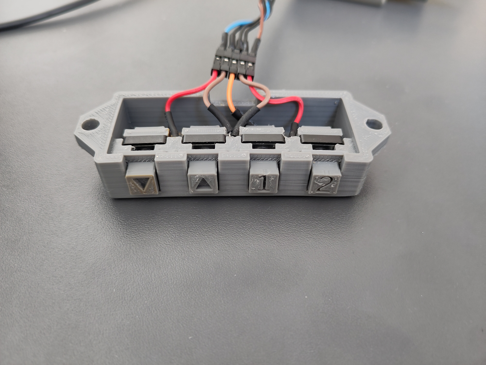
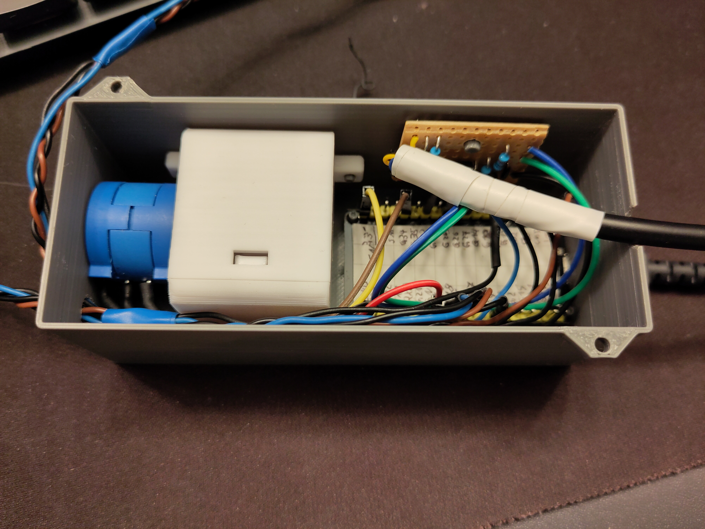
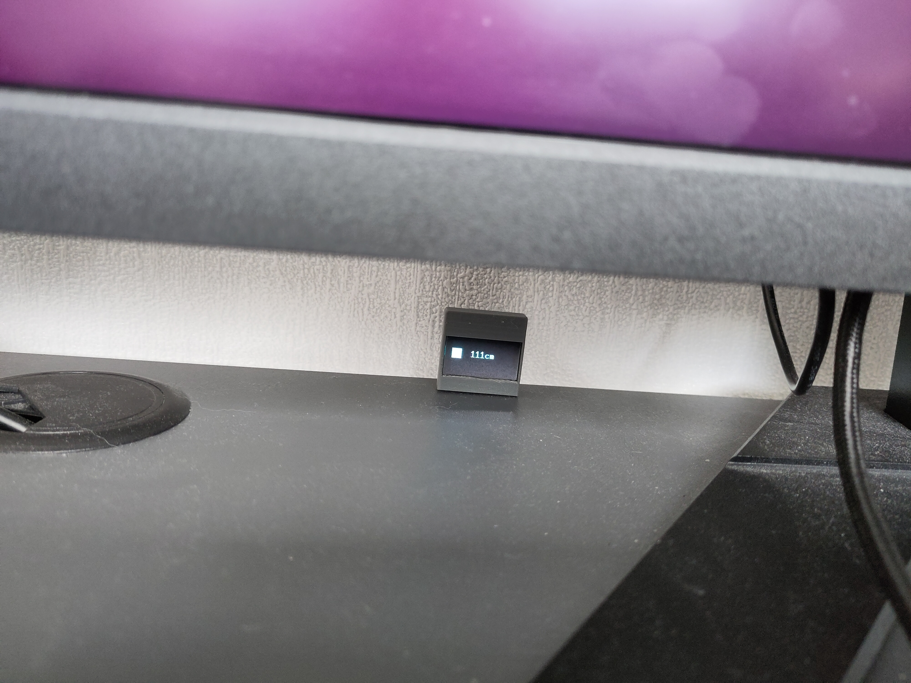

# Deposition

This repository contains **Deposition** (short for *Desk Position*), a small embedded application that controls the position of an height-adjustable desk.
This is the application in action:

<video src="https://github.com/user-attachments/assets/827e0c9c-4747-438a-ae12-fc30ed03b6e0"></video>

[Video of height-adjustable desk moving up and down](./resources/demo.mp4)

## How it works

The micro controller gets inputs via 4 buttons: up, down, position 1, position 2. When one of the buttons is pressed, the desk starts moving.
Required hardware:

- 1x precision potentiometer *Bourns 3590*, supports 10 full rotations
- 1x retractable lanyard/key chain
- 1x OLED 128x64 dot matrix *SSD1306*
- 2x photo coupler *EL817*
- 4x button
- resistors
- cables
- enclosures, 3D printed
- micro controller dev board *ESP32-WROOM-32*

### Position Detection

<video src="https://github.com/user-attachments/assets/81cddcd7-b8bb-4885-b38a-85f34ef4b4de"></video>

[Video of thread begin pulled, hooked onto screws and released, display shows current distance](./resources/test-bench.mp4)

The current height is detected with the micro controller's builtin ADC which is connected to a potentiometer. This potentiometer is in turn mechanically connected
to the insides of a retractable lanyard with a few 3D printed connectors. The thread of the lanyard is connected to a horizontal stabilizer bar underneath the desk.
When the height increases, the thread is pulled further out and when it is reduced, the spiral torsion (=clock) spring of the lanyard retracts the thread. This in
turn rotates the potentiometer clockwise or counterclockwise. This is how it looks inside:

Further details can be found in [resources/height-adjustable-desk.pdf](resources/height-adjustable-desk.pdf).

### Control of the desk motors

The desk is moved by motors located in the desk's legs. The were pre-installed in the commercial product and could be controlled with two buttons: up and down.
However, the control panel did not support moving to a memorized position. For **Deposition**, the buttons were replaced with photo couplers to emulate their
open/closed behavior while keeping the two circuits electrically separated.

The circuit diagram can be found in [resources/height-adjustable-desk.pdf](resources/height-adjustable-desk.pdf).

### Enclosure

The enclosures were designed in FreeCAD and later on in OpenSCAD. They are all 3D printed. All models can be found under <./cad>.

## Lessons learned

- General 3D design with FreeCAD and OpenSCAD was not hard after getting used to the general design process.
- Rust embedded ecosystem is nice: GPIO pins cannot be used multiple times by accident because you take ownership.
- Twisting wires is a bad idea if they are not a differential pair. I could not even get buttons or display (with 10Hz I2C) to work this way.

## Development environment

In addition to normal Rust, [install the ESP32 Rust toolchain](https://docs.esp-rs.org/book/installation/riscv-and-xtensa.html) via `espup`.
Remember to always `source ~/export-esp.sh`. You can then use the normal `cargo` commands, e.g. `cargo run --release`[^1] to compile and flash
the program onto the micro controller if it is connected.

[^1]: Debug mode will likely not working due to timing-sensitive peripherals.

For testing, [Wokwi](https://github.com/wokwi/wokwi-cli) is available. Unfortunately, the committed test does not work because it fails to read from
the persistent memory. The test can be run with `wokwi-cli --scenario wokwi-tests/go_to_options.test.yaml` if Wokwi is installed in v0.14.0 (and possibly others).
Wokwi also requires the environment variables `WOKWI_CLI_TOKEN` and `GITHUB_TOKEN` to be set.
